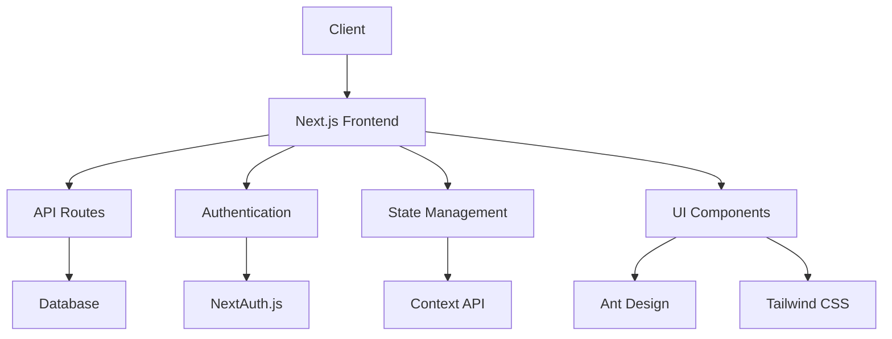
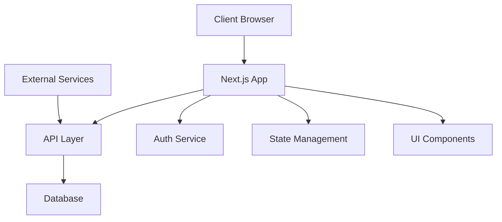
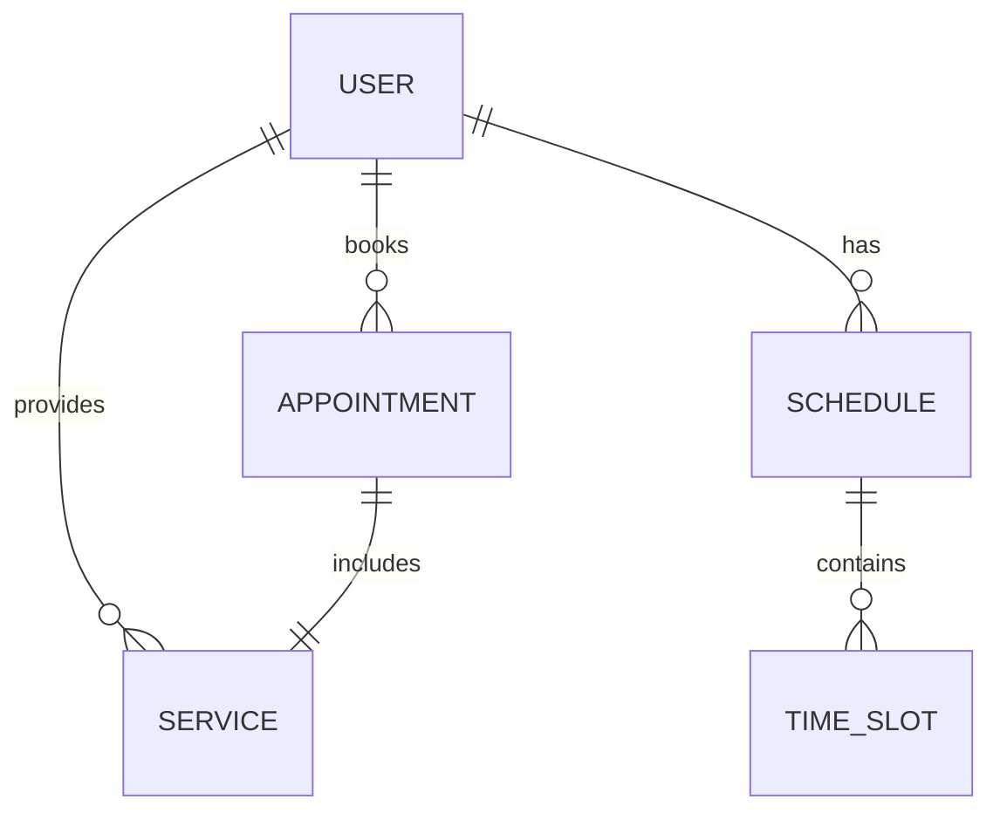
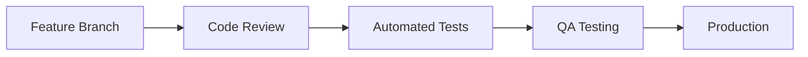

# Gents Booking Software - Software Requirements Specification

## Table of Contents

1. [Introduction](#1-introduction)
2. [System Overview](#2-system-overview)
3. [Functional Requirements](#3-functional-requirements)
4. [Non-Functional Requirements](#4-non-functional-requirements)
5. [Design Details](#5-design-details)
6. [Implementation Strategy](#6-implementation-strategy)
7. [Testing and Validation](#7-testing-and-validation)
8. [Results and Conclusions](#8-results-and-conclusions)
9. [References](#9-references)

## 1. Introduction

### 1.1 Purpose

The Gents Booking Software is a comprehensive appointment and business management system designed specifically for barbershops and salons. This document provides a detailed specification of the system's requirements, architecture, and implementation details.

### 1.2 Document Conventions

- This document follows IEEE 830-1998 standards
- Technical terms are defined in their respective sections
- Requirements are numbered sequentially within each section
- Code snippets are formatted using markdown code blocks
- Diagrams use Mermaid syntax for visualization

### 1.3 Intended Audience

- Software developers
- Project managers
- Business stakeholders
- System administrators
- End-users (barbershop owners and staff)

### 1.4 Project Scope

The Gents Booking Software is a modern web application that provides a complete solution for managing barbershop operations. The system includes features for appointment scheduling, customer management, employee management, and business analytics.

## 2. System Overview

### 2.1 System Description

The system is built using modern web technologies:

- **Frontend Framework**: Next.js with React
- **UI Framework**: Ant Design
- **Styling**: Tailwind CSS
- **Authentication**: NextAuth.js
- **Data Visualization**: Recharts and Ant Design Charts
- **State Management**: React Context API
- **API Integration**: RESTful services

### 2.2 System Architecture

The application follows a modern web architecture:



### 2.3 Directory Structure

```
├── app/
│   ├── api/              # API routes and endpoints
│   │   ├── auth/        # Authentication endpoints
│   │   ├── appointments/# Appointment management
│   │   └── services/    # Service endpoints
│   ├── dashboard/        # Dashboard components
│   │   ├── reports/     # Reporting modules
│   │   ├── services/    # Service management
│   │   └── users/       # User management
│   ├── internalDashboard/# Internal dashboard
│   ├── login/           # Authentication pages
│   ├── component/       # Reusable components
│   ├── context/         # React context providers
│   ├── hooks/           # Custom React hooks
│   └── lib/             # Utility functions
```

## 3. Functional Requirements

### 3.1 User Authentication and Authorization

1. **Authentication Methods**

   ```typescript
   interface AuthConfig {
     providers: {
       google: GoogleProvider;
       facebook: FacebookProvider;
       credentials: CredentialsProvider;
     };
     pages: {
       signIn: string;
       error: string;
     };
     callbacks: {
       jwt: (token: JWT, user: User) => Promise<JWT>;
       session: (session: Session, token: JWT) => Promise<Session>;
     };
   }
   ```

2. **Role-Based Access Control**

   ```typescript
   enum UserRole {
     ADMIN = "admin",
     SHOP_OWNER = "shop_owner",
     EMPLOYEE = "employee",
     CUSTOMER = "customer",
   }

   interface UserPermissions {
     canManageAppointments: boolean;
     canManageServices: boolean;
     canViewReports: boolean;
     canManageUsers: boolean;
   }
   ```

### 3.2 Appointment Management

1. **Core Features**

   ```typescript
   interface Appointment {
     id: string;
     customerId: string;
     employeeId: string;
     serviceId: string;
     startTime: Date;
     endTime: Date;
     status: "scheduled" | "completed" | "cancelled";
     notes?: string;
   }

   interface Schedule {
     employeeId: string;
     date: Date;
     availableSlots: TimeSlot[];
     breaks: TimeSlot[];
   }
   ```

2. **Advanced Features**
   ```typescript
   interface RecurringAppointment {
     baseAppointment: Appointment;
     recurrencePattern: {
       frequency: "daily" | "weekly" | "monthly";
       interval: number;
       endDate?: Date;
     };
   }
   ```

### 3.3 Business Management

1. **Service Management**

   ```typescript
   interface Service {
     id: string;
     name: string;
     description: string;
     duration: number;
     price: number;
     category: string;
     isActive: boolean;
   }
   ```

2. **Employee Management**
   ```typescript
   interface Employee {
     id: string;
     name: string;
     email: string;
     role: UserRole;
     services: string[];
     schedule: Schedule;
     commissionRate: number;
   }
   ```

### 3.4 Reporting and Analytics

```typescript
interface BusinessMetrics {
  revenue: {
    daily: number;
    weekly: number;
    monthly: number;
  };
  appointments: {
    total: number;
    completed: number;
    cancelled: number;
  };
  customerMetrics: {
    newCustomers: number;
    returningCustomers: number;
    retentionRate: number;
  };
}
```

## 4. Non-Functional Requirements

### 4.1 Performance Requirements

1. **Response Time Metrics**

   ```mermaid
   graph LR
     A[User Action] --> B[API Response < 500ms]
     A --> C[Page Load < 2s]
     A --> D[Real-time Update < 1s]
   ```

2. **Scalability Targets**
   - Support up to 1000 concurrent users
   - Handle 10,000+ appointments per month
   - Process 100+ API requests per second

### 4.2 Security Requirements

1. **Data Protection**

   ```typescript
   interface SecurityConfig {
     encryption: {
       algorithm: 'AES-256-GCM';
       keyRotation: '30 days';
     };
     session: {
       maxAge: 30 * 24 * 60 * 60; // 30 days
       updateAge: 24 * 60 * 60; // 24 hours
     };
   }
   ```

### 4.3 Usability Requirements

1. **Accessibility Standards**
   - WCAG 2.1 AA compliance
   - Screen reader compatibility
   - Keyboard navigation support
   - Color contrast requirements

## 5. Design Details

### 5.1 System Architecture



### 5.2 Database Schema



## 6. Implementation Strategy

### 6.1 Technology Stack

```json
{
  "dependencies": {
    "next": "15.2.2",
    "react": "^18.3.1",
    "antd": "^5.23.0",
    "next-auth": "^4.24.11",
    "recharts": "^2.15.0",
    "date-fns": "^4.1.0",
    "@ant-design/charts": "^2.0.0",
    "@ant-design/plots": "^2.0.0"
  },
  "devDependencies": {
    "typescript": "^5.0.0",
    "eslint": "^9.0.0",
    "jest": "^29.0.0",
    "cypress": "^12.0.0"
  }
}
```

### 6.2 Development Workflow



## 7. Testing and Validation

### 7.1 Testing Strategy

1. **Test Coverage Requirements**

   ```typescript
   interface TestCoverage {
     statements: 80;
     branches: 75;
     functions: 85;
     lines: 80;
   }
   ```

2. **Testing Pyramid**

   ```mermaid
   graph TD
     A[Unit Tests] --> B[Integration Tests]
     B --> C[E2E Tests]
   ```

## 8. Results and Conclusions

### 8.1 Current Status

- Core authentication implemented with NextAuth.js
- Dashboard interface developed using Ant Design
- Appointment management system functional
- Business management modules in progress
- API endpoints for core functionality implemented

### 8.2 Future Enhancements

1. **Technical Roadmap**

   ```mermaid
   gantt
       title Development Timeline
       dateFormat  YYYY-MM-DD
       section Phase 1
       Authentication      :done,    des1, 2024-01-01, 2024-02-01
       Basic Dashboard     :done,    des2, 2024-02-01, 2024-03-01
       section Phase 2
       Appointment System  :active,  des3, 2024-03-01, 2024-04-01
       Business Management :         des4, 2024-04-01, 2024-05-01
       section Phase 3
       Advanced Analytics  :         des5, 2024-05-01, 2024-06-01
       Mobile App         :         des6, 2024-06-01, 2024-07-01
   ```

## 9. References

1. IEEE 830-1998, IEEE Recommended Practice for Software Requirements Specifications
2. [Next.js Documentation](https://nextjs.org/docs)
3. [React Documentation](https://react.dev)
4. [Ant Design Documentation](https://ant.design)
5. [Tailwind CSS Documentation](https://tailwindcss.com/docs)
6. [NextAuth.js Documentation](https://next-auth.js.org)
7. [TypeScript Documentation](https://www.typescriptlang.org/docs)
8. [Jest Documentation](https://jestjs.io/docs/getting-started)
9. [Cypress Documentation](https://docs.cypress.io)

---

_This document is maintained and updated as the project evolves. Last updated: May 2024_
